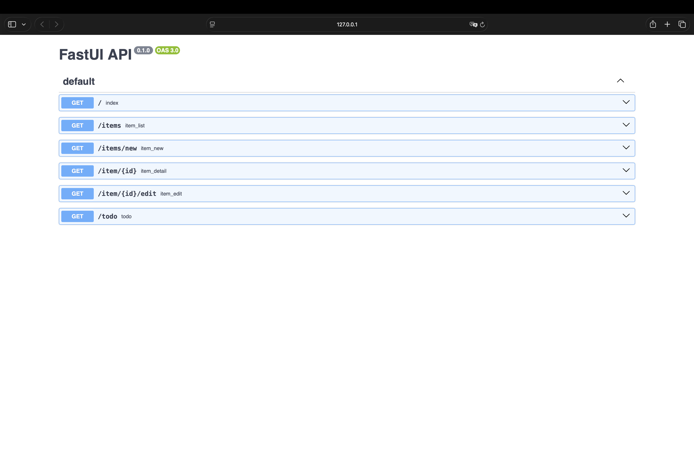
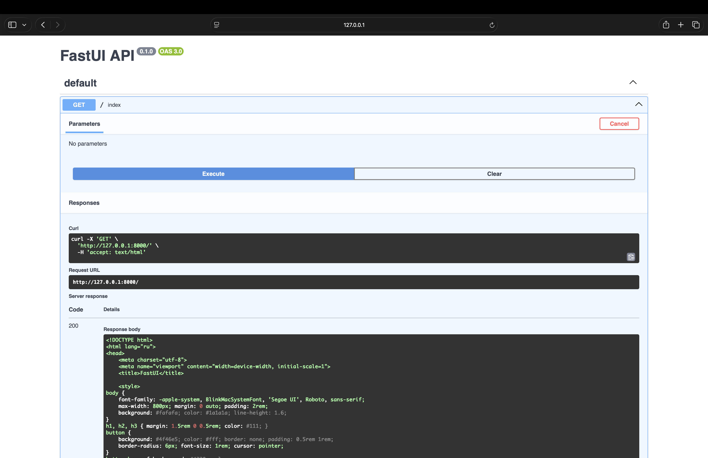
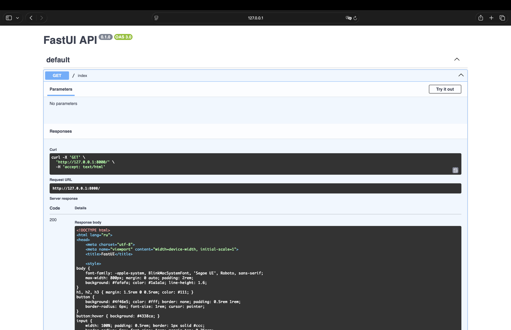

<p align="center">
  
</p>
<p align="center">
    <em>FastUI — build web UIs with Python decorators, compile to HTML, zero JavaScript required.</em>
</p>
<p align="center">
<a href="https://github.com/ndugram/fastui2/actions/workflows/tests.yml" target="_blank">
    
</a>
<a href="https://pypi.org/project/fastui2" target="_blank">
    
</a>
<a href="https://www.python.org/" target="_blank">
    
</a>
<a href="https://pypi.org/project/fastui2" target="_blank">
    
</a>
<a href="https://pepy.tech/projects/fastui2" target="_blank">
    
</a>
<a href="https://pydantic.dev" target="_blank">
    
</a>
</p>

---

**Documentation**: <a href="https://fastui2.readthedocs.io/ru/latest/" target="_blank">https://fastui2.readthedocs.io/ru/latest/</a>

**Source Code**: <a href="https://github.com/ndugram/fastui2" target="_blank">https://github.com/ndugram/fastui2</a>

---

FastUI is a modern **server-rendered UI library** for Python. It brings a decorator-based API — similar to FastAPI, but for building HTML pages — with Pydantic-validated components, URL routing, server-side actions, and a built-in Swagger UI.

Key features:

- **Fast** — components compile directly to HTML, no template engine overhead. Built-in hot reload for development.
- **Simple** — define pages as decorated Python functions, return component lists, no HTML templates.
- **Typed** — full type annotations throughout; all components are Pydantic-validated models with strict validation.
- **Zero JS** — everything compiles to plain HTML. Buttons with server actions use a lightweight POST mechanism.
- **Routed** — URL patterns with typed parameters (`/user/{id:int}`, `/post/{year:int}/{slug}`).
- **Interactive** — built-in Swagger UI via `/docs` to browse and test page routes in the browser.
- **Extensible** — custom CSS, external stylesheets, inline styles, component protocol for custom components.

## Requirements

Python 3.10+

FastUI depends on:

- <a href="https://docs.pydantic.dev/" target="_blank"><code>pydantic</code></a> — component model validation and serialization.
- <a href="https://pypi.org/project/annotated-doc/" target="_blank"><code>annotated-doc</code></a> — parameter documentation via `Annotated[type, Doc("...")]`.

## Installation

```console
$ pip install fastui2

---> 100%
```

## Example

### Create it

Create a file `main.py`:

```python
from fastui import App, ui

app = App()


@app.page("/")
def home():
    return [
        ui.heading("FastUI", level=1),
        ui.text("Build UIs with Python. No JavaScript required."),
        ui.button("About", on_click="/about"),
    ]


@app.page("/about")
def about():
    return [
        ui.heading("About", level=1),
        ui.text("FastUI compiles Pydantic components to HTML."),
        ui.link("Back", url="/"),
    ]


if __name__ == "__main__":
    app.run()
```

### Run it

```console
$ python main.py
```

### Check it

You will see output like:

```
  ╔════════════════════════════════════════════╗
  ║    FastUI Dev Server                       ║
  ╠════════════════════════════════════════════╣
  ║                                            ║
  ║  →  http://127.0.0.1:8000                 ║
  ║                                            ║
  ║  ♻  Hot reload                            ║
  ║                                            ║
  ║  📖  Docs  http://127.0.0.1:8000/docs      ║
  ║                                            ║
  ║  Routes:                                   ║
  ║   • /                                     ║
  ║   • /about                                ║
  ║                                            ║
  ╚════════════════════════════════════════════╝
```

Open `http://127.0.0.1:8000` in your browser.

### Interactive API docs

Now go to <a href="http://127.0.0.1:8000/docs" target="_blank">http://127.0.0.1:8000/docs</a>.

You will see the automatic interactive API documentation with all registered routes:



Each route shows its URL pattern, summary, parameters, and response schema:



Routes with path parameters (`{id:int}`, `{slug}`) have input fields for testing:



### Upgrade the example

Now modify `main.py` to get more out of FastUI. Each upgrade below builds on the previous one.

<details markdown="1">
<summary>With typed URL parameters...</summary>

Add a route with an integer parameter:

```python
@app.page("/user/{id:int}", title="Profile")
def user_profile(id: int):
    return [
        ui.heading(f"User #{id}", level=1),
        ui.text(f"Profile page for user {id}."),
        ui.link("Back", url="/"),
    ]
```

Visit `http://127.0.0.1:8000/user/42`. The `id` parameter is automatically converted to `int`.

</details>

<details markdown="1">
<summary>With server actions (POST handlers)...</summary>

Buttons can call Python functions on the server via POST:

```python
counter = 0


def increment() -> list:
    global counter
    counter += 1
    return [
        ui.heading(f"Count: {counter}", level=1),
        ui.button("+1", on_click=increment),
        ui.link("Back", url="/counter"),
    ]


@app.page("/counter")
def counter_page():
    return [
        ui.heading("Counter", level=1),
        ui.text(f"Value: {counter}"),
        ui.button("+1", on_click=increment),
    ]
```

When `on_click` receives a callable, the framework registers it as a POST endpoint and
replaces it with the action URL before rendering.

</details>

<details markdown="1">
<summary>With custom CSS...</summary>

Pass custom CSS to the `App` constructor:

```python
CUSTOM = """
body { background: #1a1a2e; color: #e0e0e0; }
h1 { color: #e94560; }
button { background: #e94560; color: #fff; border: none; }
"""

app = App(css=CUSTOM)
```

Or use external stylesheets:

```python
app.stylesheets = [
    "https://cdn.jsdelivr.net/npm/bootstrap@5.3/dist/css/bootstrap.min.css",
]
```

</details>

<details markdown="1">
<summary>With OpenAPI tags...</summary>

Group routes in the Swagger UI with tags:

```python
@app.page("/users", title="Users", tags=["users"])
def users():
    return [ui.heading("Users", level=1)]

@app.page("/items", title="Items", tags=["items"])
def items():
    return [ui.heading("Items", level=1)]
```

Tags appear as a filter in the Swagger UI header.

</details>

<details markdown="1">
<summary>With a multi-page layout...</summary>

Share navigation across pages with a helper function:

```python
def nav() -> ui.page:
    return ui.page([
        ui.link("Home", url="/", style="margin-right: 1rem;"),
        ui.link("Blog", url="/blog", style="margin-right: 1rem;"),
        ui.link("About", url="/about"),
    ], style="padding: 1rem; background: #f0f0f0; border-radius: 8px; margin-bottom: 1rem;")

@app.page("/")
def home():
    return [nav(), ui.heading("Home", level=1), ui.text("Welcome!")]

@app.page("/about")
def about():
    return [nav(), ui.heading("About", level=1), ui.text("FastUI details.")]
```

</details>

## Components

All built-in components are available through the `ui` builder:

| Component | Builder | HTML |
|---|---|---|
| Heading | `ui.heading("text", level=1)` | `<h1>text</h1>` |
| Text | `ui.text("content")` | `<p>content</p>` |
| Button | `ui.button("label", on_click=...)` | `<button>label</button>` |
| Input | `ui.input(label="Name")` | `<label>Name<input></label>` |
| Link | `ui.link("text", url="/")` | `<a href="/">text</a>` |
| Code | `ui.code("code")` | `<pre><code>code</code></pre>` |
| Divider | `ui.divider()` | `<hr>` |
| Page | `ui.page([...])` | `<div>...</div>` |

Every component accepts optional styling:

```python
ui.heading("Styled", level=2, style="color: red;")
ui.button("Big", class_name="btn-lg", style="padding: 1rem;")
ui.text("Centered", style="text-align: center;")
```

## Routing

Routes map URL patterns to handler functions. Patterns support typed parameters:

| Pattern | Example URL | Handler receives |
|---|---|---|
| `/` | `/` | — |
| `/about` | `/about` | — |
| `/user/{id:int}` | `/user/42` | `id=42` (int) |
| `/hello/{name}` | `/hello/world` | `name='world'` (str) |
| `/post/{year:int}/{slug}` | `/post/2025/hello` | `year=2025, slug='hello'` |

Routes are registered in order; the first match wins.

## Server actions

Buttons can call server-side Python functions via POST:

```python
def handle_click() -> list:
    return [
        ui.heading("Clicked!", level=2, style="color: green;"),
        ui.link("Back", url="/"),
    ]

@app.page("/")
def index():
    return [
        ui.button("Click me", on_click=handle_click),
    ]
```

The framework automatically:

1. Registers the callable as a POST endpoint at `/_ui/action/<id>`
2. Replaces the callable with the action URL in the rendered HTML
3. On click, the browser POSTs to the action URL
4. The handler runs and returns new components rendered as HTML

## OpenAPI documentation

FastUI auto-generates OpenAPI 3.0 schema for all routes. Available at `/docs` (Swagger UI)
and `/openapi.json` by default.

```python
app = App(
    title="My API",
    version="2.0.0",
    description="API description in **Markdown**.",
    docs_url="/api-docs",
    openapi_url="/api-schema.json",
)
```

Disable docs:

```python
app = App(docs=False)
```

## Hot reload

Enable auto-refresh on file changes:

```python
app.run(hot_reload=True)
```

The server polls `.py` files in the current directory and the `fastui` package directory.
On change, the browser refreshes automatically.

## Examples

See the [examples](examples/) directory for 20 complete, runnable programs:

| # | Example | What it shows |
|---|---|---|
| 1 | [hello_world](examples/01_hello_world.py) | Minimal app — one page, one heading |
| 2 | [all_components](examples/02_all_components.py) | Every built-in component type |
| 3 | [route_params](examples/03_route_params.py) | URL patterns with typed parameters |
| 4 | [server_actions](examples/04_server_actions.py) | POST callback handlers |
| 5 | [custom_css](examples/05_custom_css.py) | Dark theme with custom CSS |
| 6 | [forms](examples/06_forms.py) | Input fields and form layout |
| 7 | [navigation](examples/07_navigation.py) | Multi-page navigation with links |
| 8 | [docs_config](examples/08_docs_config.py) | Custom OpenAPI docs metadata |
| 9 | [layout_page](examples/09_layout_page.py) | Page component for grouping |
| 10 | [counter](examples/10_counter.py) | Interactive counter with actions |
| 11 | [todo](examples/11_todo.py) | Simple todo application |
| 12 | [hot_reload](examples/12_hot_reload.py) | Hot reload demo |
| 13 | [multi_page](examples/13_multi_page.py) | Shared navigation layout |
| 14 | [no_docs](examples/14_no_docs.py) | Running without docs |
| 15 | [external_stylesheets](examples/15_external_stylesheets.py) | Bootstrap integration |
| 16 | [single_component](examples/16_single_component.py) | Returning single vs list |
| 17 | [advanced_routing](examples/17_advanced_routing.py) | Complex multi-param routes |
| 18 | [inline_styles](examples/18_inline_styles.py) | All style combinations |
| 19 | [minimal](examples/19_minimal.py) | Absolute minimal app (7 lines) |
| 20 | [dynamic_routes](examples/20_dynamic_routes.py) | Dynamically generated routes |

## FAQ

- **Why would I use FastUI instead of Flask + Jinja2?**
  FastUI eliminates the template layer — you write UIs entirely in Python without HTML files.
  It's ideal for small to medium apps where the overhead of a template engine isn't justified.

- **Why would I use FastUI instead of Streamlit?**
  FastUI gives you explicit control over routing, URL parameters, and page structure.
  Streamlit is script-based and re-runs everything on every interaction; FastUI uses
  traditional request-response with proper URL routing.

- **Does FastUI support async handlers?**
  Not yet. Handlers are synchronous. Async support is planned.

- **Can I use FastUI with an existing HTTP server?**
  The `App` class runs its own dev server. For production, you'd wrap it in ASGI/WSGI —
  this is on the roadmap.

- **Does FastUI support WebSockets?**
  Not currently. Server-sent events and WebSocket support may be added later.

- **Can I write my own components?**
  Yes. Any object with a `to_html()` method satisfies the `Component` protocol.
  Pydantic models with `to_html()` work seamlessly.

- **Is FastUI production-ready?**
  FastUI is in early development (v0.1.0). The API may change. It's suitable for
  internal tools and prototypes but not yet for customer-facing production apps.
